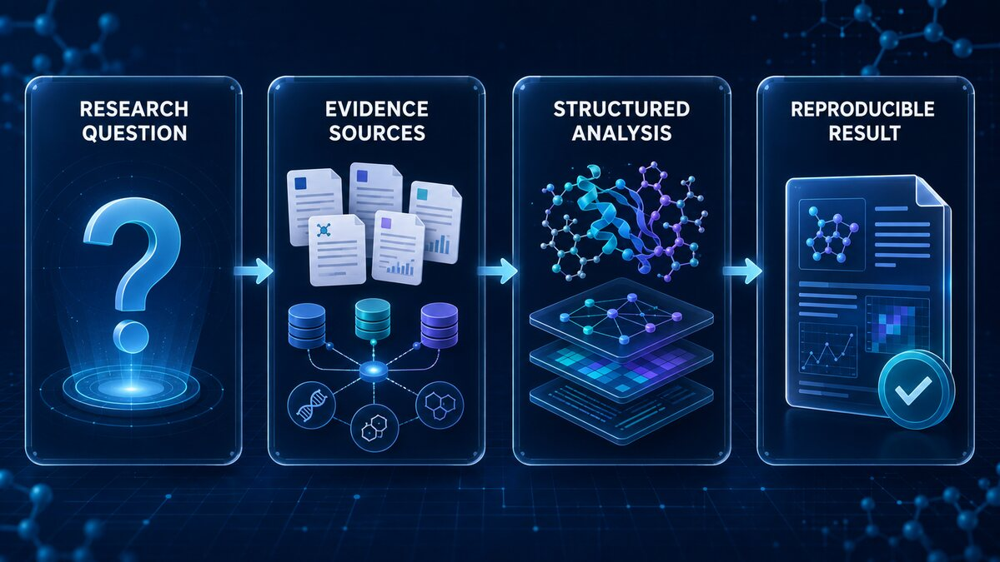

# Synon Biomed

## The intelligent workspace for biomedical discovery

Synon Biomed brings literature, molecular insight, scientific tools, and
reproducible execution into one focused workspace for modern biomedicine.

Synon Biomed 将文献证据、分子洞察、科学工具与可复现执行汇聚到一个工作台，
帮助生物医学团队更快、更清晰地推进研发。


## What you can do / 核心能力

- **Ask better questions / 提出更好的问题** — turn a research idea into a clear, evidence-aware plan. / 将研究想法转化为清晰、可核验的研究计划。
- **Find and connect evidence / 连接关键证据** — explore biomedical sources, targets, pathways, and publications in one flow. / 在同一条工作流中探索生物医学来源、靶点、通路与文献。
- **Work with scientific data / 处理科学数据** — inspect structures, files, experiments, and results with context preserved. / 在保留上下文的同时处理结构、文件、实验与结果。
- **Move from insight to action / 从洞察走向执行** — use guided tools and recoverable tasks to keep research moving. / 借助引导式工具与可恢复任务持续推进研究。

## How it works / 技术底座

The product combines a Go service boundary, a provenance-controlled Web client,
and a recoverable scientific execution layer. Evidence, task state, and tool
calls stay connected from research question to result.

产品由 Go 服务边界、可追溯的 Web 工作台和可恢复的科学执行层组成，
让证据、任务状态与工具调用从研究问题一路连到结果。

The design keeps optional connectors and compute environments isolated, while
the core experience remains one coherent workspace.

可选连接器和计算环境保持隔离，核心体验仍然统一在一个工作台中。

## Technical view / 技术视图

Evidence flow — from a research question to a traceable result.
证据链：从研究问题到可追溯结果。



Execution fabric — one workspace coordinating tools and compute environments.
执行网络：一个工作台协调工具与计算环境。


Trust loop — inputs, bounded execution, evidence, and review stay connected.
可信闭环：输入、受控执行、证据与审阅保持连接。


## Why Synon Biomed / 为什么选择 Synon Biomed

**Evidence first. Reproducible by design. Built for serious research.**

**以证据为先，以复现为本，为严肃科研而生。**

Synon Biomed is designed for researchers who need a dependable place to think,
investigate, compare, and act — without losing the trail from question to result.

Synon Biomed 面向需要可靠研究环境的团队：从问题、调查、比较到结果，
每一步都保留清晰的研究脉络。

## Releases and packages / 发布与分发包

Versioned downloads are published on [GitHub Releases](https://github.com/Victor-Xu-1/synon-biomed/releases).
Each release includes Linux/Windows archives and SHA-256 checksums. The same
files are published as an OCI bundle to [GitHub Packages](https://github.com/Victor-Xu-1/synon-biomed/pkgs/container/synon-biomed).
This bundle is for automated download with ORAS, not `docker run`. If a version is absent,
it has not been published; source downloads are not prebuilt installers.

版本化安装包和 SHA-256 校验文件在 Releases 提供；Packages 通过 OCI 格式分发同一批
文件，可用 ORAS 自动拉取，不是可直接运行的容器。未显示的版本尚未发布。
See [installation, package downloads and upgrade guidance](docs/operations-runbook.md).

## Run from source / 从源码运行

The source repository is publicly available. Use Ubuntu or WSL with Git,
Go >=1.26, Node.js >=22.22 and <25, and npm installed.
源码仓库可直接获取。请在 Ubuntu 或 WSL 中安装 Git、Go >=1.26、
Node.js >=22.22 且 <25，以及 npm。

```bash
git clone https://github.com/Victor-Xu-1/synon-biomed.git
cd synon-biomed
bash scripts/dev/install-source-cli.sh
synon start
```

Wait for `READY_URL=http://127.0.0.1:8765/#/login`, then open that URL in your browser.
在浏览器打开 `http://127.0.0.1:8765/#/login`。

首次运行可能进入 onboarding 引导；系统没有默认 Web 密码。
There is no default Web password.

On Linux/WSL amd64, the service provisions the required Python and R scientific
runtimes once at startup. Their immutable generations live under the
user-resolved managed state root (`SYNON_HOME`, or the platform user data
directory) and are reused by later tasks; no checkout or machine-specific
absolute path is embedded in the product. Native Windows releases currently
provide the gateway/UI only and do not include the bundled Python/R runtime
assets; use WSL or Linux for scientific execution. First-run settings list
these required runtimes separately from optional local scientific runtimes.
Optional groups start unselected and are prepared only after an explicit
choice. See the operations runbook for the storage layout, reuse contract,
status and recovery guidance.

在 Linux/WSL amd64 上，服务启动时会一次性准备必需的 Python 和 R 科研环境。不可变环境生成保存在
系统根据当前用户解析出的统一状态目录（`SYNON_HOME`，未设置时使用平台用户数据目录）下，
后续任务直接复用，不写入代码仓库，也不包含任何机器专属绝对路径。首次设置会把必需环境
与可选科研环境分开显示；可选环境默认不勾选，只有用户明确选择后才会准备。存储布局、
复用规则、状态和恢复方式见运维手册。当前原生 Windows 发布包只提供网关/UI，未包含
Python/R 科研运行时资产，需要使用 WSL 或 Linux 才能执行科研任务。

## Learn more / 了解更多

- [Versioning and releases / 版本与发布](docs/governance/versioning.md)
- [Repository maintenance](docs/governance/repository-maintenance.md)
- [Operations and setup / 运维与配置](docs/operations-runbook.md)
- [Research Harness / 科学 Harness](docs/engineering/synon-harness-conformance.md)
- [Runtime data lifecycle / 运行时数据生命周期](docs/engineering/runtime-data-lifecycle.md)
- [Release acceptance / 发布验收](docs/release-acceptance-contract.md)
- [Contributing](CONTRIBUTING.md) · [Security](SECURITY.md) · [Code of Conduct](CODE_OF_CONDUCT.md)

## Project status / 项目状态

Synon Biomed is an actively developed source edition. Capabilities, integrations,
and release packaging continue to evolve through verified, reviewable updates.

Synon Biomed 是持续演进中的源码版。能力、集成和发布包装会通过
可验证、可审阅的更新持续完善。

## Licensing / 许可

First-party code is licensed under **AGPL-3.0-only**, except where separate
component terms apply. Compliant commercial use is permitted. Optional written
commercial agreements may offer different terms only for code the licensor has
the right to license. See [LICENSE](LICENSE),
[commercial licensing boundaries](COMMERCIAL-LICENSE.md), and the
[third-party inventory](docs/THIRD_PARTY.md).

自有代码采用 **AGPL-3.0-only**，另有组件许可声明的部分除外。遵守许可证的商业
使用不需要另行购买授权。可选书面商业协议仅能覆盖授权方有权另行授权的代码。
第三方组件保留原许可证、版权及来源声明。
