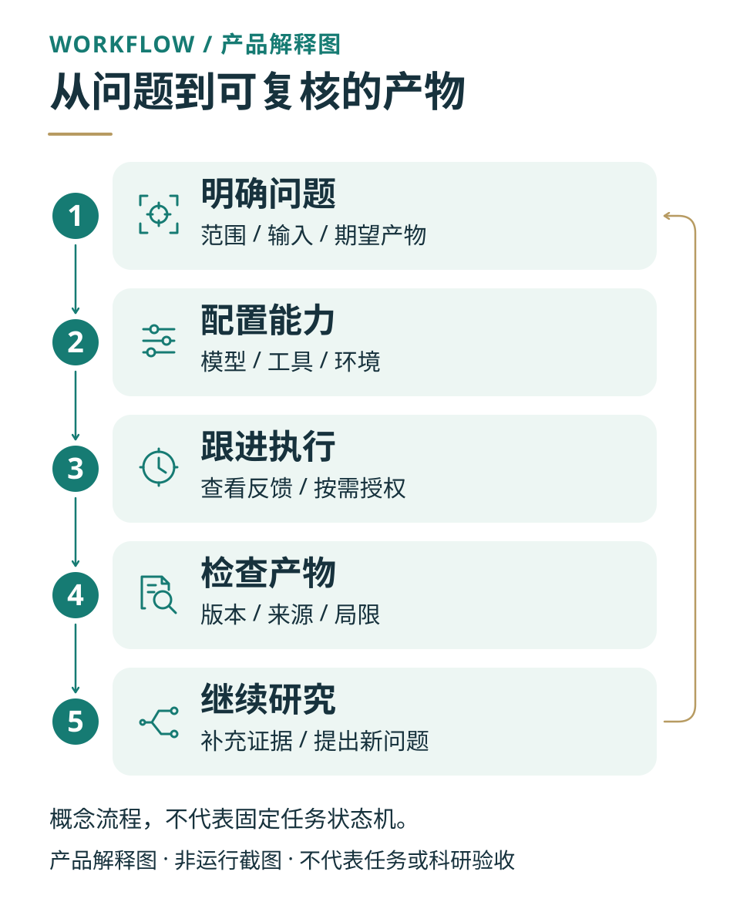

# 使用指南 · 从首次进入到复核产物

这份指南面向已经能打开 Synon Biomed 的研究用户，按中文界面的实际入口说明操作。
还没有安装或服务无法启动，请先看[安装与首次启动](getting-started.md)；
产品定位与典型场景见[产品指南](product/README.md)。

一次完整的使用过程是：**确认模型 → 选择项目与材料 → 发起有边界的任务 → 处理待办 → 检查并保存结果**。
页面能打开、模型连接成功、软件已就绪和科研结论可信，是不同的检查点。

*产品解释图 · 概念工作流程，不是运行截图，也不是固定任务状态机。*



先确定问题和输入，再选择必要能力；执行中结合反馈处理待办；得到产物后核对版本、
来源与局限，再决定是否继续。下面的分步操作对应这些环节，而不是承诺每个任务都自动成功。

## 1. 第一次打开工作台

使用安装程序或管理员提供的地址；本地源码服务通常报告
`http://127.0.0.1:8765/#/login`。远程部署应使用其实际 HTTPS 地址，不要照搬本机地址。
没有通用默认密码：使用自己的账号或当前部署显示的登录方式。
第三方登录是否可用取决于部署配置，不是所有安装都会显示相同选项。

首次使用可能进入“配置你的科研工作空间”。引导按以下顺序展开：

1. **欢迎页**：确认正在配置正确的账号。
2. **选择网络访问范围**：按任务需要选择外部科研服务，不必为了进入工作台而允许全部分组。
3. **选择科研能力**：分别检查“连接器”“技能”“本地软件”。Python/R 为系统管理的必需核心运行时；可选环境只勾选确实需要的项目。
4. **补充科研背景**：填写目标、约束和期望输出，可以附加参考文件。只提供允许当前服务和模型处理的内容。
5. **选择第一个任务**：选择建议或填写“自定义科研任务”。建议不是已经执行的分析。
6. **配置大模型**：可以此时“添加模型配置”，也可以先不填、稍后在设置中完成。最后点击“进入工作台”。

所选首个任务会作为草稿带入工作台，**仍需检查后发送**，不能把完成引导当成研究任务已完成。
引导中的个性化任务建议可能使用模型读取科研背景和可读取附件；因此不应把未发送首个任务理解为“引导阶段不会调用模型”。
可选软件的后台准备也可能仍在进行。

**检查点：**能进入工作台；当前账号正确；输入框中的草稿、附件及能力选择符合预期。
如果提示重新选择文件，重新附加即可；文件名恢复不等于浏览器仍持有原文件。

## 2. 配置并确认当前模型

打开“设置 → 模型”，同一服务内的路由为 `/#/settings/models`。
如果已有管理员或本人配置的模型，先检查现有配置，不要直接删除或覆盖。

1. 点击“新增模型配置”。
2. 填写“配置名称”，选择“提供方”，填写服务商实际给出的“模型 ID”“Base URL”和需要的“API Key”。
3. 点击“保存”，检查配置列表中的“当前使用”；切换已有配置时可点击“设为当前”，再确认当前模型。
4. 在该配置上点击“测试”，查看连接成功或失败反馈。
5. 回到任务输入框，再检查模型选择器。会话所选模型与设置页默认模型都需要符合本次任务要求。

模型 ID 是提供方的接口标识，不应凭展示名称猜测。自托管模型是否需要密钥、接口地址如何填写，
以该服务实际配置为准。测试失败时先检查地址、模型标识、密钥状态、网络和服务额度，不要通过关闭安全校验来绕过错误。

测试连接和正式任务都可能向提供方发出请求并产生费用；更高的推理强度通常也会增加耗时和消耗。
不要把 API Key 粘贴进对话、项目背景、截图或公开 Issue。
模型连接成功只证明这次测试，不代表所有工具、数据源或科研方法都可用。

**检查点：**目标配置为“当前使用”，连接测试有明确结果，输入框没有“当前会话未选择模型”的阻断提示。
部署侧问题请交给管理员，参见[模型配置与运行权威](operations-runbook.md#model-authority)。

## 3. 用项目组织任务和输入文件

### 创建或选择项目

在侧栏使用“新建项目”，填写名称后点击“创建”，或选择已有项目继续。
新建/编辑项目时三个字段各有用途：

- **名称**：帮助你在项目列表中识别项目，不会作为名称自动写入 Agent prompt。
- **说明**：便于记录项目目标、对象或阶段。
- **Agent Context**：会进入该项目下 Agent 的系统提示，适合放长期背景和约定，例如物种、单位、参考版本与证据要求。不要放密钥，也不要放尚未核实却要求模型照抄的结论。

在所选项目中新建任务。发送前确认任务属于正确项目，避免把不同研究的数据和长期约定混在一起。
浏览器中的项目与对话分别使用 `/#/projects/...` 和 `/#/conversation/...`；优先通过界面导航，不需手工编造 ID。

### 添加本次任务要使用的材料

打开输入框的添加菜单：

- **“添加文件”**：从本机上传文件。
- **“你的文件”**：选择当前项目已经上传或生成的文件，确认后添加到消息。
- 输入框也支持用 **`@`** 唤起文件等引用选项；具体可选项以当前会话显示为准。

附件或引用出现后，检查名称、数量和选中的材料，再补充每份文件的用途。
例如说明哪份是原始数据、哪份是参考方法、哪份只是旧版草稿。
不要仅写“按附件做”，却没有说明目标、分析单位或期望交付物。

**检查点：**所需文件已在输入区显示，没有上传失败或待重新选择提示。
“已上传”不等于文件已经被读取、解析完整或支持你的结论；首次任务应先要求检查材料。

## 4. 分清模型、专家、技能、连接器和科研环境

“设置 → 科学工具集”包含“专家”“技能”“连接器”“科研环境”四个页签。
模型单独在“设置 → 模型”配置，不属于这四个页签。

| 你在选择什么 | 它负责什么 | 选择后仍要确认什么 |
| --- | --- | --- |
| 模型 | 理解请求、推理和生成回答 | 配置、当前选择、服务可达性和额度 |
| 专家 | 一组科研助手身份、规则和默认配置 | 是否适合本次任务；不代表一个真人专家已审阅 |
| 技能（Skill） | 某类工作的操作说明、脚本与参考资料 | 本次任务是否实际使用了它；所需依赖是否可用 |
| 连接器（MCP） | 与外部数据库、服务或工具通信 | 启用、配置、凭证、工具权限和连接状态 |
| 科研环境 | 为计算准备所需软件与依赖 | 安装是否完成；该任务是否真正执行并产出结果 |

**技能：**在目录查看说明，按任务选择所需项。输入框的添加菜单在有可用能力时可搜索并选择技能或连接器。
没有出现在当前会话选项中时，应检查其安装、启用和可用范围，不要仅把名称写进提示词就假定已接入。

**连接器：**在卡片上检查“配置”“连接凭证”“工具权限”和连接检查结果。
有些服务需要自己的账号、密钥或授权，有些依赖本机程序。打开目录不等于安装或授权；
“连接成功”也不证明一次具体查询或分析成功。先了解输入会发往哪里，再给它敏感材料。
详见[连接器操作](operations-runbook.md#connectors)和[外部服务凭证](operations-runbook.md#hosted-mcp-credentials-byok)。

**科研环境：**在 `/#/settings/environments` 查看“已就绪”“正在准备”或失败提示。
打开页面不会安装软件；使用“下载环境”并“确认下载”，或通过“管理预下载”保存选择，才会安排准备。
需要处理时按页面提示重试，不要删除环境目录或缓存来强行消除失败状态。
环境 ready 只表示其检查通过，不代表某个科学分析已验证。
当前科学 kernel 的隔离执行路径要求 Linux/WSL，不能由 native Windows/macOS 安装成功推断任务执行可用。

**检查点：**本次只选择必要能力；连接器权限、外部费用和计算环境已明确。
普通材料整理不应为了“功能齐全”先下载全部科学软件或开通远程算力。

## 5. 发出一个范围清楚的任务

一个好用的请求至少说明：研究问题、使用的材料、允许的操作、约束、期望产物和完成标准。
复杂任务可打开“更多发送选项”，选择“计划优先”，先查看计划再决定是否执行。
简单任务可普通发送；选择能力或写好草稿本身不等于已经发送。

### 可直接修改使用的示例

以下是**输入模板，不是系统已经完成的任务或真实结果**。先附加你有权使用的 1–3 份文本资料或论文，
再替换方括号中的主题。不需要为这个示例另行安装可选科学软件；核心环境仍按实例要求准备。
若实际读取需要额外能力，应先说明缺口。

```text
请仅基于我这条消息所附的材料，整理“[填写研究主题]”的证据概览。

先列出实际可读取的文件，确认各文件讨论的对象、方法和主要结果。
遇到无法读取、缺页或关键字段缺失，请明确指出，不要补造内容。

输出一份 Markdown 文件 evidence-summary.md，包含：
1. 研究问题与材料范围；
2. 逐篇证据表：文件名、研究对象、方法、主要发现、限制、可定位的出处；
3. 材料之间的一致与分歧，以及还不能回答的问题。

区分原文事实、作者解释和你的推断。未提供的 DOI、数值或实验条件写“未报告”。
不要联网扩展搜索，不要安装软件、调用付费科学服务或修改原始材料。
如确需扩大范围，请先说明原因和影响，等待我决定。
完成后给出文件入口，并说明做了哪些检查、哪些检查尚未进行。
```

**发送前检查：**项目、模型、附件、能力选择和许可范围均正确；输出格式和文件名明确。
**发送后检查：**请求出现在对话中，状态开始更新。没有看到请求时先检查发送/上传错误，避免连续点击造成重复任务。

## 6. 跟进任务：等待、回答、审批和恢复

点击任务状态可查看“任务中心”，需要时打开“查看执行记录”或“查看计划”。
按钮随任务状态和能力变化，不是每个任务都会同时显示所有操作。

| 当前提示或状态 | 你应该做什么 |
| --- | --- |
| 排队、启动、运行、整理结果或审阅中 | 查看当前阶段与最新记录；仍有进展时继续等待，不要反复提交相同请求 |
| “等待用户回答” | 在问题卡选择或填写“自定义回答”，再提交；不确定时使用“继续讨论”，不要把“跳过”当作已经回答 |
| “等待计划审批” | 打开“查看计划”，检查范围、输入、外部服务和计算需求；同意后才点“批准并执行” |
| 操作授权卡 | 展开“更多”检查目标、代码或环境，再选“允许”或“拒绝” |
| 模型不可用、额度或连接错误 | 先修复相应配置；若页面提供“选择其他模型”“继续运行”或“稍后重试”，按实际原因操作 |
| 状态加载失败或实时连接离线 | 优先重新加载运行状态；旧画面不是当前执行状态的证明，不要立即重发整项任务 |

授权范围可能包含“本次”“本会话”“本项目”“全局”，具体取决于操作。
选择能够完成当前工作的最小范围。**不是所有操作都提供“本次”**：例如网络/主机访问可能只有持久范围，
不接受该范围时应拒绝并讨论其他方案，不能认为点“允许”都只影响这一条请求。

需要中断时使用当前任务显示的“停止任务”或“暂停任务”控件，并等状态确认。
停止请求失败时任务仍可能运行；不要把点击按钮当作已经停止。
计算资源中的“中断”与“终止”也不同：后者会销毁对应 kernel，内存变量会丢失，不宜作为普通刷新操作。

恢复前先检查已完成步骤和已有产物，再在原任务中继续；不要为消除红色提示而重新执行可能收费或有外部副作用的步骤。
详见[状态与故障排查](operations-runbook.md#failure-triage)。

## 7. 检查产物，再下载或分享

任务显示“已完成”后，先读最终说明和限制，再打开消息中的文件入口，或到会话右侧的“产物”区域查找文件。
右侧工作台折叠时先展开；必要时使用“刷新产物”或搜索文件名。
支持的格式会进入对应预览器，不支持的格式可以下载原文件后用合适的软件检查。

预览区的“更多文件操作”可以进入“完整详情”“版本历史”或“来源追踪”。完整产物页的检查顺序建议如下：

1. **详情**：核对文件名、类型、大小、项目、任务及当前版本。确认没有把参考文件或中间文件误当最终交付。
2. **版本**：选择需要查看的版本，核对页面显示的版本号与内容；仅有一个文件名不足以确定具体版本。
3. **来源**：查看系统实际记录的生成说明、代码、环境和依赖。显示“暂无来源记录”或“来源信息生成中”时，不能写成谱系已经完整。
4. **验证**：读取具体检查项与警告。没有记录不等于通过，工程或自动审阅通过也不能替代科学方法与结论的人工判断。
5. **回看任务**：对照原始要求，检查引用能否定位、数值与单位是否一致、局限是否保留，以及所有承诺的文件是否真的存在并能打开。

使用“下载”保存本地副本。完整产物页的“导出”是导出到已连接的云存储，
需要确认凭证、Bucket 和对象路径；它不是另一种无条件的本地下载，也会向外部服务发送文件。
共享“内部链接”仍要求接收者登录并有访问权限，不等于公开发布文件。
删除项目会连同任务和产物一起删除，不要用删除来解决预览或同步问题。

**完成检查点：**能打开实际产物；明确所用版本、来源和未验证事项；需要保留的文件已经下载或导出到自己确认的位置。
图片、流畅的回答或绿色状态不能单独证明科学结论可靠。

## 8. 常见卡点与下一步

| 遇到的问题 | 先做什么 | 进一步参考 |
| --- | --- | --- |
| 登录失败或页面打不开 | 确认地址与账号；本机 WSL 优先使用服务报告的数字 loopback 地址，不猜默认密码 | [登录与 Web](operations-runbook.md#login-and-web) |
| 模型测试失败、无法发送 | 核对当前模型、ID、地址、凭据、网络和额度；保留脱敏错误 | [模型运行](operations-runbook.md#model-authority) |
| 看得见连接器却不能用 | 检查安装、启用、凭证和工具权限；连接超时先看具体错误 | [MCP 超时](operations-runbook.md#remote-mcp-connection-timeouts) |
| 科研环境一直准备或失败 | 查看实际准备状态、磁盘/网络错误；按页面重试，不清空已有环境 | [本地科研软件](operations-runbook.md#local-scientific-software) |
| 任务无新输出 | 先区分等待回答、审批、长计算和连接丢失，再查看执行记录或刷新状态 | [诊断与可观测性](operations-runbook.md#observability-and-diagnosis) |
| 文件或来源没有显示 | 核对项目与版本，刷新产物；记录缺失信息，不把它推断为成功 | [证据与产物](modules/evidence.md) |

报告问题时提供版本或提交、操作路径、脱敏后的错误，以及必要的任务/文件标识。
不要上传完整凭据、个人敏感数据或未公开研究。漏洞通过[安全报告渠道](../SECURITY.md)私下报告，
一般问题按[贡献指南](../CONTRIBUTING.md)提供可复现信息。

[返回文档目录](README.md) · [产品指南](product/README.md) · [模块导航](modules/README.md)
